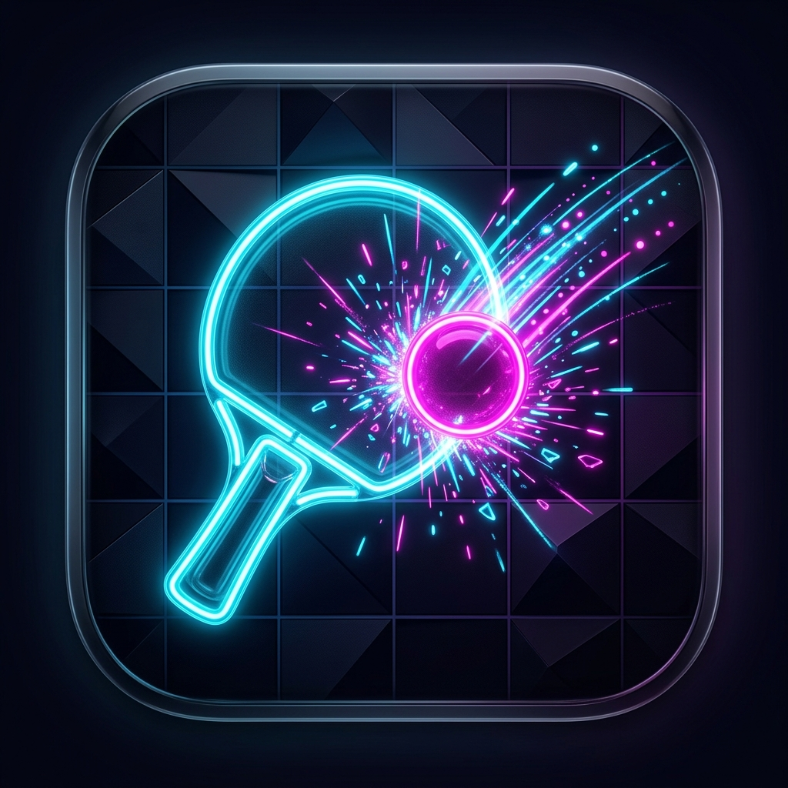

# 🌟 Neon Ping Pong — macOS Arcade Game

A high-performance, native macOS neon-style Ping Pong game compiled specifically for **Apple Silicon (M3)**. Built entirely in Swift with **zero external dependencies**, it utilizes Apple's native **SwiftUI**, **SpriteKit**, and **AVFoundation** frameworks to deliver a buttery-smooth 120 FPS gaming experience with real-time audio synthesis.

<p align="center">
  
</p>

---

## ✨ Features

- **⚡ Apple Silicon Optimized**: Runs natively on Apple Silicon ARM64 architecture, leveraging Metal-backed SpriteKit for maximum efficiency.
- **🌀 ProMotion 120 FPS Support**: Silky-smooth gameplay designed for high-refresh-rate displays.
- **✨ Real-Time Bloom (HDR Glow)**: Simulates a glowing HDR neon bloom effect using CoreImage filters that can be adjusted dynamically.
- **✨ Organic Particle Effects**: Includes custom radial-gradient particle systems for glowing ball trails and impact spark bursts.
- **🎛️ Live Developer Console**: Customize game parameters (launch speed, maximum speed, bounce randomness, glow radius, screen shake multiplier, and synthesizer waveforms) in real-time.
- **🎹 Dynamic Sound Synthesizer**: Generates all sound effects (beeps, slide notes, arpeggio scores, win/lose tracks) directly in memory, bypassing the need for audio assets.
- **🌪️ Neon Storm Mode**: Introduces double-rotating central barriers that deflect the ball dynamically using advanced physics momentum.
- **🧠 Adaptive AI Opponent**: Play against a computer with multiple difficulties (Easy, Medium, Hard, Impossible) using smooth lerping movements.
- **👥 Local Multiplayer**: Local Player vs Player support using distinct keyboard controls.

---

## 🎮 Game Controls

| Key | Action | Player |
| :--- | :--- | :--- |
| **Mouse / Y-Axis** | Move Paddle Up & Down (Mouse Mode) | Player 1 (Left) |
| **W** / **S** | Move Paddle Up & Down (Keyboard Mode) | Player 1 (Left) |
| **Up Arrow** / **Down Arrow** | Move Paddle Up & Down | Player 2 (Right) |
| **Spacebar** / **Click** | Pause / Resume Game | Both |
| **Escape** | Quit to Main Menu | Both |

---

## 🛠️ Build & Run Instructions

Since the application uses only native Apple frameworks, compiling it is fast and easy.

### Prerequisites
Make sure you have the Swift compiler installed (comes with Xcode Command Line Tools). Verify with:
```bash
swift --version
```

### Compiling & Packaging
Run the build script to compile the Swift source, package it as a proper macOS App Bundle, and construct the multi-resolution `.icns` app icon:
```bash
chmod +x build.sh
./build.sh
```

### Launching the Application
You can double-click the packaged app bundle in Finder:
```
build/NeonPingPong.app
```
Or open it from your terminal:
```bash
open build/NeonPingPong.app
```

---

## 📂 Project Structure

```
mac-ping-pong/
├── main.swift         # SwiftUI UI code, SpriteKit Scene, Synth system & @main entry
├── Info.plist         # macOS App Bundle property list metadata
├── AppIcon.png        # Source high-resolution app icon (1024x1024)
├── build.sh           # Shell automation script to compile & package the app
├── README.md          # Project documentation (this file)
└── build/
    └── NeonPingPong.app  # Built macOS Application Bundle
```

---

## 🧪 Real-Time Audio Synthesis Details

The retro audio system uses `AVAudioEngine` to construct and schedule memory-buffered sound waves dynamically.
- **Paddle Hits**: Tones scale in frequency depending on the point of collision (higher tones near the paddle tips).
- **Goal Scored**: Play a triumphant digital arpeggio (C5-E5-G5-C6) on score.
- **Game Over**: Ascending major chimes for a Player victory, or a descending sad sequence for a CPU victory.
- **Waveform Customization**: Segmented control in the settings lets you select **Sine**, **Square**, or **Triangle** waveforms, or mute the synthesizer.
